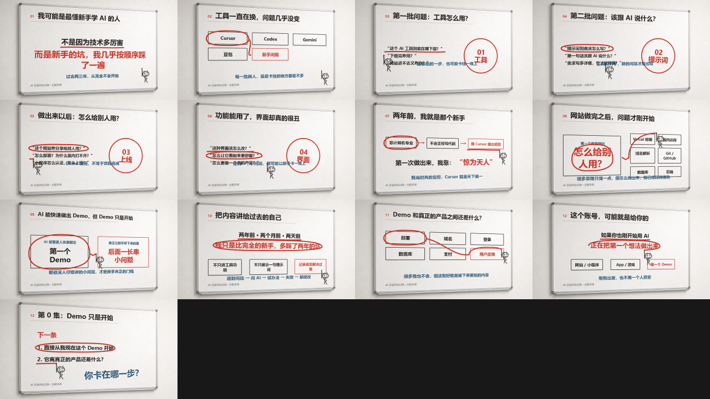
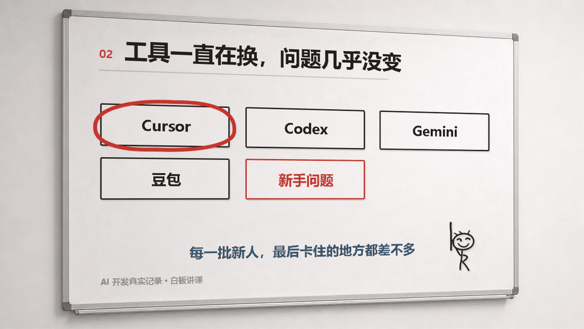
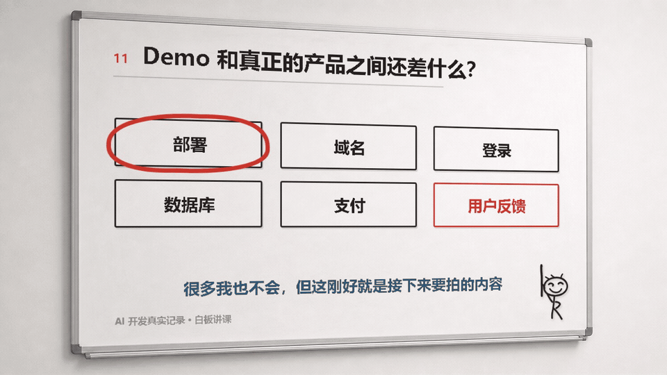

# 班班白板视频 Skill

把中文口播做成可复现的 16:9 白板讲解视频：板书持续留在白板上，讲到重点时，小人再移动过去画圈、划线或箭头。


## 它解决什么

- 用 `timeline.json` 管理板书、分镜、时间和批注动作。
- 用 HTML/CSS 排中文板书，避免生成式图片把汉字画错。
- 用 SVG 画圈、划线和箭头，并让小人跟随笔迹移动。
- 用 Playwright 固定帧抓图，再由 FFmpeg 合成 MP4，同一份时间轴可以重复渲染。

这不是“整块白板自动手写”。中文正文是稳定排版，手绘感来自重点批注和教师小人。

## 安装

克隆到 Codex 的 Skill 目录：

```powershell
git clone https://github.com/fanshouheng/banban-whiteboard-video-skill.git "$HOME/.codex/skills/banban-whiteboard-video"
cd "$HOME/.codex/skills/banban-whiteboard-video"
npm install
```

系统还需要 Chrome 或 Edge，以及可直接调用的 FFmpeg。

重新打开 Codex 后，可以这样说：

```text
用 $banban-whiteboard-video，把这段最终口播做成 16:9 中文白板讲解视频。
```

## 示例

仓库当前自带一条完整案例：`AI 新手定位`，13 页板书，时长 3 分 38.1 秒。



- [20 秒动态预览](examples/ai-newbie-positioning-preview.mp4)
- [完整时间轴](timeline.json)
- [小红书 / 抖音发布文案示例](examples/social-post-copy.md)

### 几秒动图

每段 5.5–6 秒，960 x 540，适合直接预览白板圈线、箭头和小人移动效果。

| 连续圈划四类新手问题 | 工具换了，问题没变 |
|---|---|
|  |  |
| 网站做完后，问题才开始 | Demo 到产品还差什么 |
|  |  |

## 本地预览

把最终音频放到 `output/voiceover.mp3`，然后运行：

```powershell
npm run preview
```

关键帧保存在 `output/playwright/`。确认没有文字拥挤、路径偏移和小人遮挡后，再渲染完整视频：

```powershell
npm run render
```

输出为 `output/whiteboard-ai-newbie-final.mp4`，规格为 1920 x 1080、30 fps、H.264 + AAC。

## 核心文件

```text
SKILL.md                     # Codex 工作流与边界
timeline.json                # 13 页示例的内容、帧范围和批注
index.html / styles.css      # 白板画布与排版
app.js                       # 场景、路径和播放逻辑
render-video.cjs             # 抓帧与 FFmpeg 合成
assets/                      # 白板和教师小人素材
examples/                    # 可公开展示的轻量示例
```

第三方素材来源与许可见 [THIRD_PARTY_NOTICES.md](THIRD_PARTY_NOTICES.md) 和 `licenses/`。本仓库尚未声明整体开源许可证；第三方素材仍遵循其原许可证。
